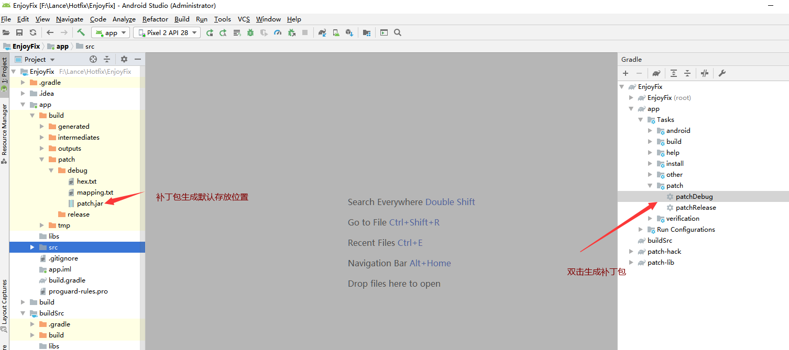

# 热修复

## 项目结构

- app
  - 测试Demo
- buildSrc
  - 插件源码
- patch-hack
  - 用于插桩进入所有工程代码的类
- patch-lib
  - 执行热修复的依赖库


## 使用方法

先直接运行一次app，然后打开权限。修改app中的`Utils`类，然后执行生成补丁。

> 没用代码动态申请读写权限，请自行到设置中加入权限。真实项目中，补丁可以从服务器下载后放入程序私有目录，如: `context.getExternalFilesDir("")`，私有目录无需动态权限。



执行完成后，默认在`app/build/patch/`下生成**patch.jar**，这个jar包就是我们的补丁包。测试时候，可以使用`adb push patch.jar /sdcard/` 命令把补丁放入sdcard目录下。然后重启app，即可看到执行修改之后的效果。

> 经测试，在Android 19、21、26、28的官方模拟器中都能完成修复。


## 插件配置

app下的`build.gradle`

```groovy
//引入插件
apply plugin: com.enjoy.patch.plugin.PatchPlugin

//配置插件
patch {
     //在debug模式下开启热修复，默认为false
    debugOn true 
    //application无法热修复，
    //(题外话：application可以在插件中解析manifest，但是java实现插件，解析xml太麻烦了，如果是groovy实现的很简单)
    applicationName 'com.enjoy.enjoyfix.MyApplication'
    //设置补丁的输出目录,可选，默认为 `app/build/patch/`
    output xxxx
}

```

补丁插件会输出：

- hex.txt

  - 记录类是否修改的缓存，不要手动修改！

- mapping.txt

  - 如果开启混淆，记录混淆的映射文件，下一次混淆使用同样的mapping

- patch.jar

  - 对比缓存，如果存在修改，则生成对应的补丁包

  

如果开启混淆，需要加入如下配置：

```java
-keep class com.enjoy.patch.**{*;}
```

测试工程中已经加入了。